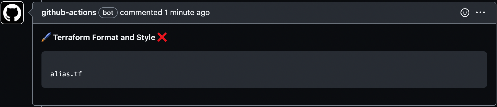

# Terraform Custom Actions

Custom Terraform GitHub Actions for infrastructure planning and provisioning.


## Terraform Plan Action

This action combines and runs the following Terraform commands on a configuration and posts a comment with the generated plan on a pull-request.

### Format

Checks whether the configuration has been formatted correctly.

```
terraform fmt -check
```

A comment is posted in case the configuration is not formatted properly.



## Terraform Apply Action


## Commentator Action
